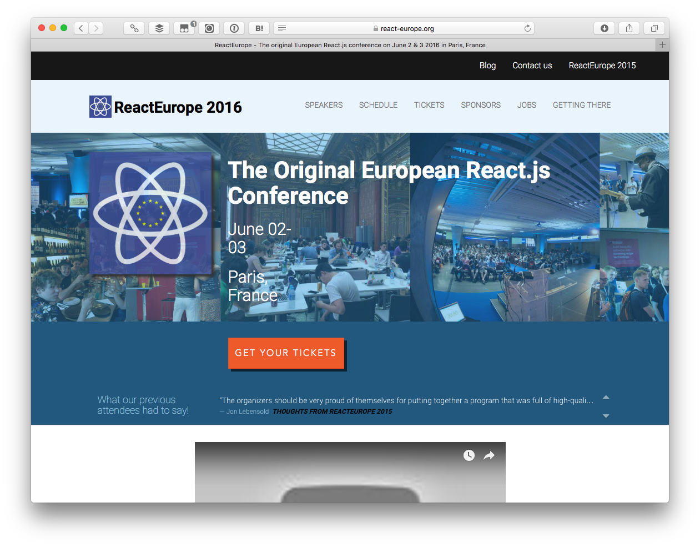
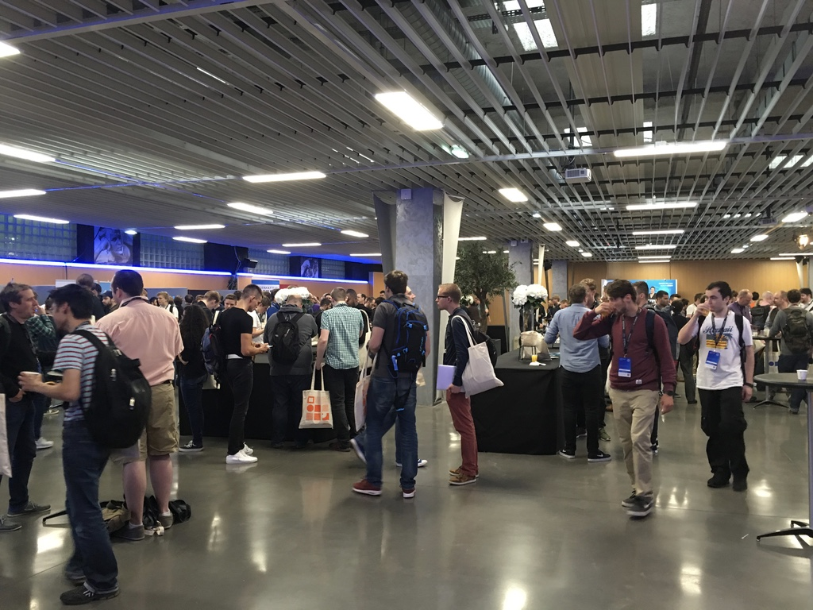
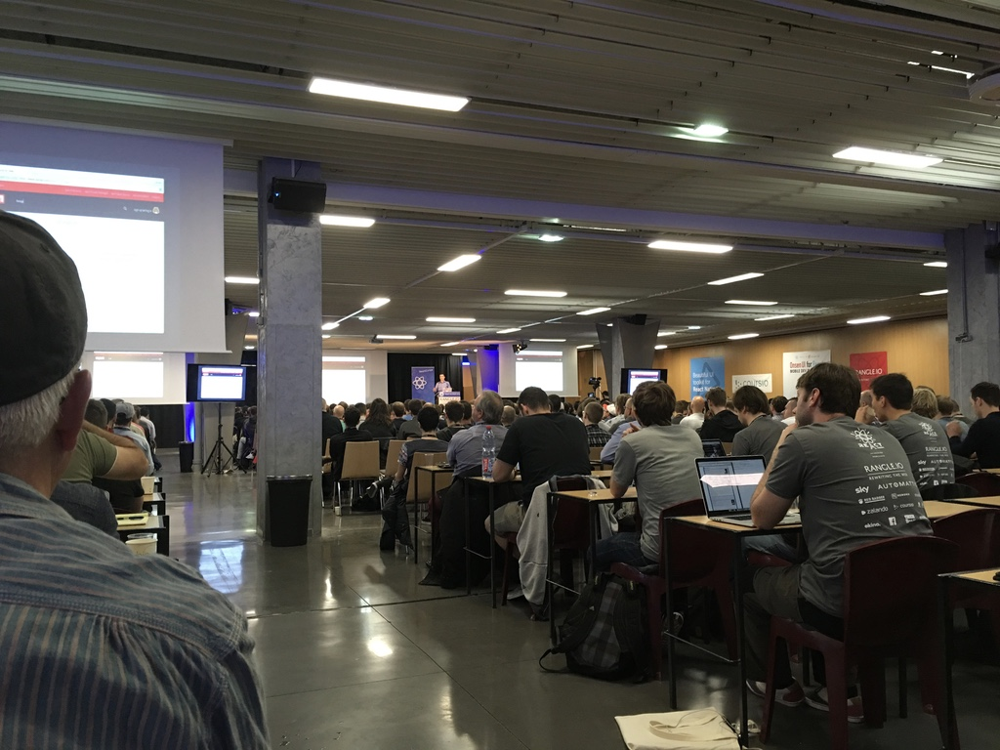
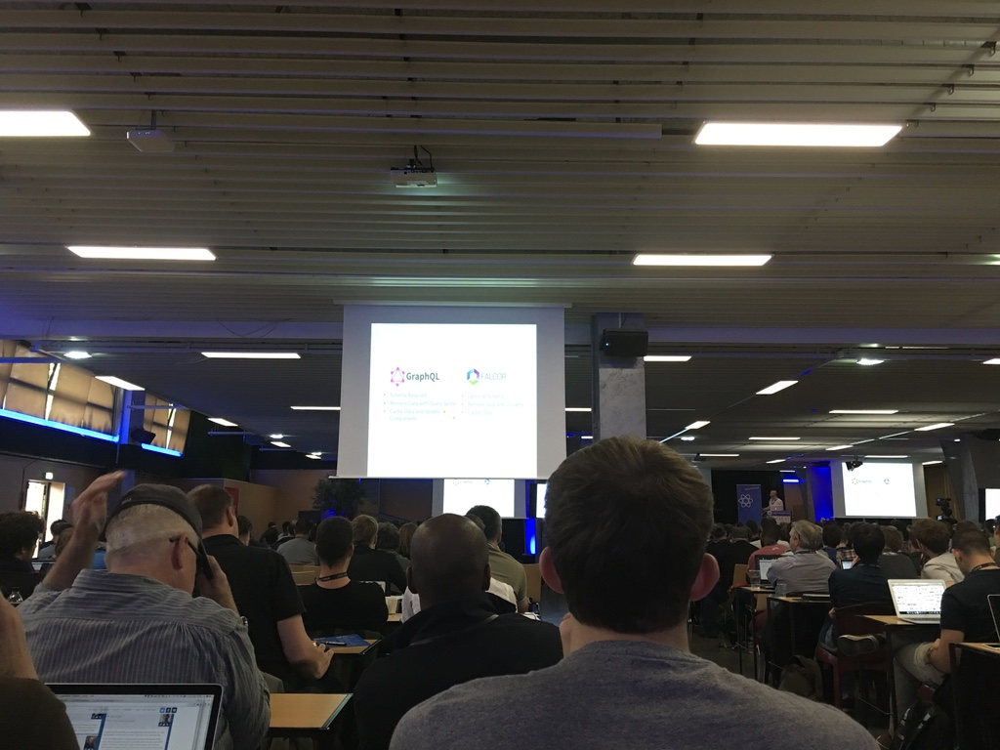
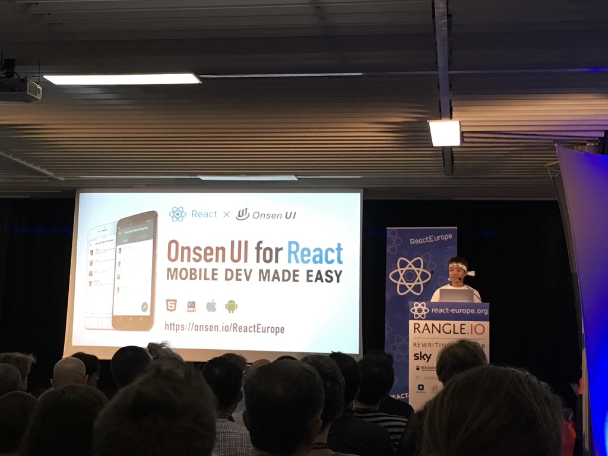

6月2〜3日にパリで行われた[React Europe](https://www.react-europe.org)にMonaca×Onsen UIでブース出展しました。筆者（MOONGIFT 中津川）は個人的にたまたま参加していたのですが、今回はイベントの概要を簡単に紹介します。

Monacaブース。

### React Europeとは？

React EuropeはFacebookが開発しているReactのコミュニティイベントで、アメリカで行われているReact Confに次ぐ規模で行われるヨーロッパ最大のReact開発者向けのイベントです。約1,500〜2,000人くらいの開発者が参加していたようです。

### 主なセッションと内容

#### Reactのパフォーマンス向上のための施策

ReactはVirtualDOMを使っているのでビューを意識することなく使えますが、よりパフォーマンスを向上させるためにはキーを使ったり、shoudUpdateComponentを使うなど工夫できるポイントがあります。

#### アニメーションについて

React Nativeで問題になりやすいアニメーション処理についてです。幾つかの実装がありますが、それぞれに利点欠点があるので注意する必要があります。

#### チャットアプリの実装

React Native、React（Web向け）を共通のコードで、かつディープリンクも処理できるようにした実装が紹介されました。コンポーネント化されているのでFacebookの開発者向けカンファレンスであるf8の専用アプリにも埋め込んで利用できていました。

### Redux-2とRedux Debugger

ReduxはFluxライブラリですが、今回のReact EuropeではRedux-2のリリースと、開発や本番環境でのデバッグでも使えるRedux Debuggerが紹介されていました。

### GraphQL

Facebook側の登壇で注目されていたのがGraphQLでした。Reactと組み合わせて使うのが進められていますが、既存のREST APIをラップするような使い方は避けるべきとのことです。GraphQL用のライブラリを使い、データベースをラッピングして提供するのが良いようです。

## React × Onsen UIの発表

アシアルでも初日のライトニングトークの中でReact × Onsen UIの紹介をしました。React × Onsen UIを使うことで、Reactの中でOnsen UIを使ってスマートフォンに最適化したUI、機能が使えるようになります。React Nativeとは異なりハイブリッドアプリでReactを使えるのが利点です。

----

Reactはとても盛り上がっており、カンファレンス自体も活気がありました。次回（React Europe 2017）はロンドンで行われる予定とのことです。Reactに興味のある方は今からライブラリを開発したり、事例を作ってみてはいかがでしょう。
